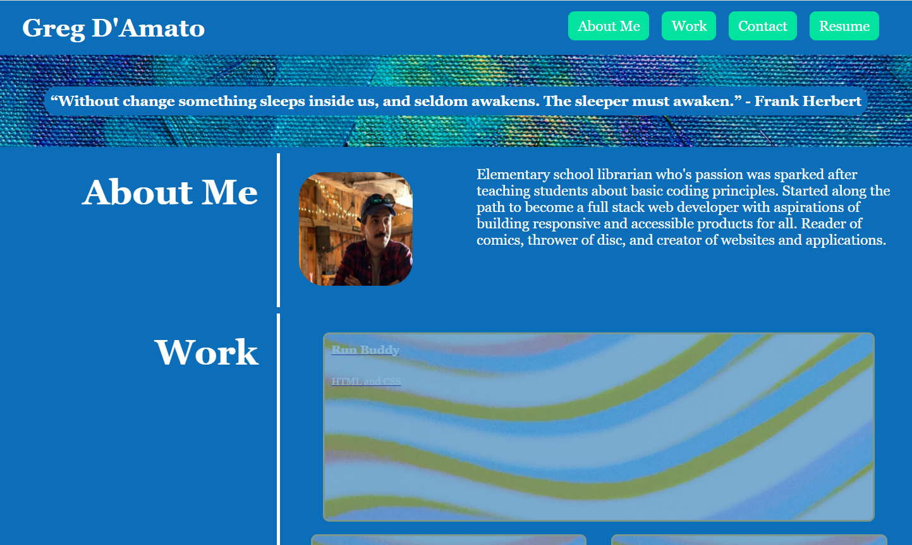
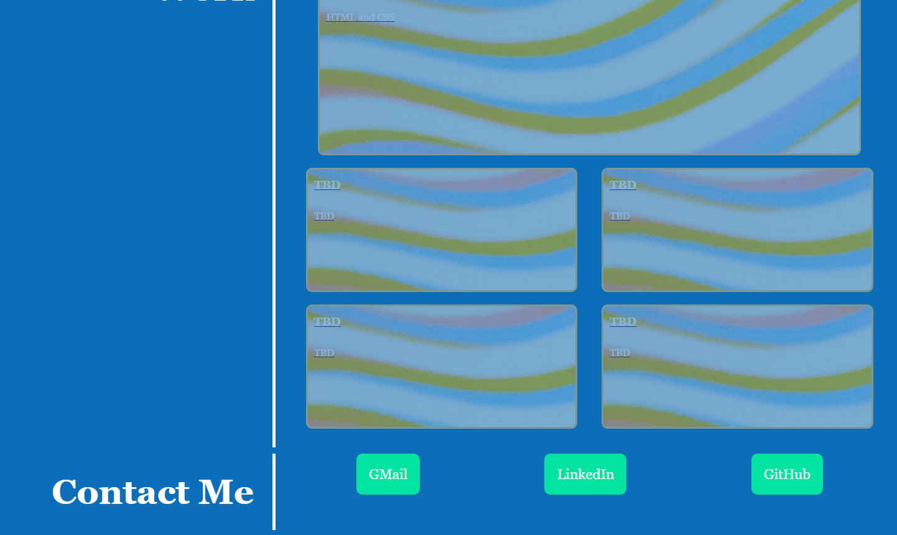

# Greg D'Amato's Portfolio

## Description

This project was assigned by Rutgers Coding Bootcamp as a build your own portfolio activity using HTML and CSS. The goal of the project was to create a portoflio using HTML and CSS that would be responsive to mutliple webpages/devices. This was done through the use of media queries. We were also asked to utilize pseudo classes to add effects to our work. 

## Links

[Link to website](https://https://damatgre.github.io/aragon-wilson-wings/)

[Link to repository](https://https://github.com/damatgre/aragon-wilson-wings)

## Screenshot

## Resources Used
https://www.pexels.com/search/background/
https://www.w3schools.com/

